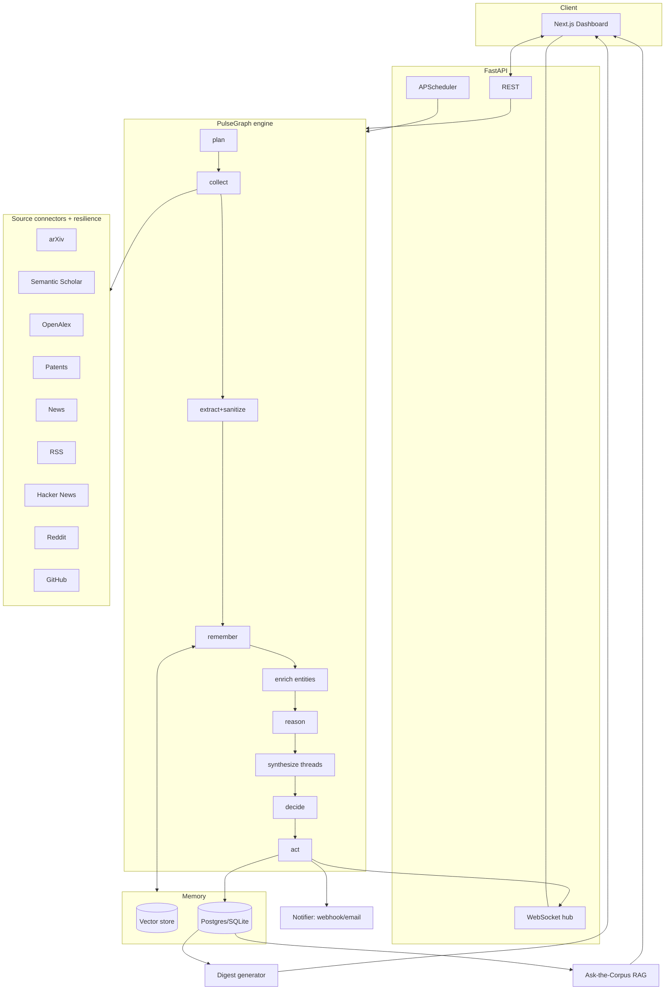

# InsightPulse — Autonomous Research & Competitor Intelligence Agent — Master Plan v2

> ### ⚠️ This is the original planning document, not a description of the shipped system.
>
> Implementation was driven by the hackathon tasks as they arrived, and diverged from this plan
> in several places. **For what actually exists, read [`README.md`](./README.md).**
>
> Notable divergences:
>
> | This plan says | What was actually built |
> |---|---|
> | PulseGraph state-machine engine | A ReAct loop in `app/agents/agent.py` driven by a policy in `decision_engine.py` |
> | Memory layer: embeddings + vector store + 3-stage dedup | **`app/memory/`**: task context, working memory with versioning and compression, selective per-agent context construction, and a JSON-persisted long-term store with relevance retrieval — no vector DB, no new dependency |
> | Single agent | **Multi-agent**: an orchestrator delegates to a Research Agent and a Competitive Agent with disjoint tool scopes, then consolidates (`app/agents/orchestrator.py`, `specialists.py`) — added in Task 3 |
> | Claude (Anthropic) reasoning | **Google Gemini** primary, Anthropic optional, deterministic reasoner as fallback |
> | Tracking Profiles, PostgreSQL, vector store, scheduler, alerts, digests, auth | **Not built.** Runs are held in memory; there is no database, scheduler or multi-user layer |
> | Next.js + Tailwind + Recharts frontend | Vanilla ES modules with hand-rolled SVG charts, served by FastAPI — no build step |
> | 5 source types | **5 tools over 13 providers**, including a live-web tool (Tavily) added in Task 2 and NewsData.io added later |
> | Digest generator | **Intelligence Report** — PDF / HTML / Markdown / JSON, with source provenance auditing |
>
> The agentic requirements in §3 and §4 *were* delivered, and are covered by 108 automated tests.

*Single reference document: requirements, architecture, agent design, sources, and full feature specs — from hackathon MVP to real product.*

**v2 changelog (what changed from v1)**

| Change | v1 | v2 | Why |
|---|---|---|---|
| Orchestration | LangGraph | **PulseGraph** — a small, explicit, dependency-free state-machine engine (LangGraph-shaped node contract) | Every node transition is emitted as a first-person event to the live Activity Log. Zero version risk, fully inspectable, and the graph is the demo. |
| Zero-key operation | not addressed | **Simulation Mode** — every connector and the LLM have deterministic offline implementations | The demo can never die from a rate limit or a missing key. Judges can run it in 60 seconds. |
| Dedup | embedding similarity | **Three-stage: URL/DOI canonical key → SimHash near-dup → embedding cosine** | Cheap checks first; catches syndicated news rewrites that embeddings alone miss. |
| Cross-source synthesis | "nice-to-have" | **Signal Threads — promoted to core** | This is the single biggest differentiator vs. a search-and-summarize wrapper. |
| Vector store | Chroma | **Local numpy store persisted in the relational DB (pgvector-ready)** | One less service; identical interface so pgvector/Pinecone is a config swap. |
| Scoring | LLM only | **LLM score + per-profile learned weights from user feedback** | Closes the loop; scoring gets better as the analyst uses it. |
| **New** | — | Opportunity/Threat Radar, Signal Graph, Trend Velocity, Ask-the-Corpus (RAG), Competitor Battlecards, Run Replay, Cost Governor, Source Health board, Prompt-Injection Defense, Digest exports | Detailed in §6–§9. |

---

## 0. How to Use This Document

Read top to bottom, or jump by section.

- The goal is a **working, deployed, autonomous agent** — not a slide deck, not a chatbot wrapper.
- Features are split into **MVP** (built now, demoable) and **Scale-up** (post-hackathon).
- Directly answers the brief: *"an autonomous AI agent capable of continuously tracking research and competitor activities, analyzing vast information sources, and delivering concise, actionable insights in real time."*
- All 6 agentic components (Goal, Reasoning, Planning, Tools, Memory, Action) are **visibly implemented and demoable** — §3 maps each one to a file path and a UI surface, because judges score what they can see.

---

## 1. Who Uses This Platform

| Role | Who they are | Their #1 job | Device |
|---|---|---|---|
| **Analyst / User** | R&D lead, founder, competitive-intel analyst | Define what to track, review insights, act on alerts | Desktop |
| **Admin** (Phase 2) | Team/org owner | Manage members, topics, API budget | Desktop |
| **Agent (system actor)** | The autonomous AI | Continuously monitor, reason, deliver — without re-prompting | Server-side, always-on |

Single-user dashboard is enough for the hackathon, but auth is built server-side from day one so multi-tenant is a flip, not a rebuild.

---

## 2. Full Requirement Coverage (traceability map = acceptance checklist)

| Problem statement requirement | Feature that satisfies it | Where |
|---|---|---|
| Track **scientific publications / research trends** | Research Feed — arXiv + Semantic Scholar + OpenAlex | §5.1 |
| Track **patent developments** | Patent Feed — PatentsView / Google Patents | §5.2 |
| Track **competitor strategies** | Competitor Tracker + Battlecards | §5.3 |
| Track **industry news** | News Feed — NewsAPI/GNews + RSS + Hacker News | §5.4 |
| Track **social media sources** | Social Signal Feed — Reddit (+ HN discussion) | §5.5 |
| Track **engineering activity** (v2 addition) | Repo Signal Feed — GitHub releases/repos | §5.6 |
| **Analyze vast information sources** | Reasoning & Scoring Engine | §6 |
| **Deliver concise, actionable insights** | Insight Cards + Digest Generator + Alerts | §8 |
| **In real time** | Scheduled loop + WebSocket live dashboard | §4, §9 |
| **Continuously** (not one-shot) | APScheduler-driven autonomous runs | §9 |
| **Error handling** (judged) | Circuit breakers, per-source degradation, Source Health board | §10 |

If any row is missing at demo time, that's an unmet requirement.

---

## 3. The 6 Core Agentic Components — mapped to code and to UI

| Component | Implementation | File | Visible in UI at |
|---|---|---|---|
| **Goal** | Tracking Profile: keywords, competitors, source types, threshold, cadence, `goal_statement` in natural language | `models.py::TrackingProfile` | Profiles page |
| **Planning** | Planner node turns one goal into a per-source query plan with rationale + budget allocation, before any tool is called | `agent/nodes/plan.py` | Activity Log, "Plan" tab of a run |
| **Tools** | 9 connectors behind one `SourceConnector` interface with retry/backoff/circuit-breaker | `sources/*` | Source Health board |
| **Memory** | 3-stage dedup, vector store, entity memory, run history, trend timeseries | `memory/*` | "Suppressed N duplicates" badge, Trends chart |
| **Reasoning** | Claude scores novelty / relevance / significance with a written justification + evidence citation | `agent/nodes/reason.py` | Every Insight Card, Insight Detail |
| **Action** | Persist insight, push WS update, raise alert, build Signal Threads, generate digest, send webhook/email | `agent/nodes/act.py`, `delivery/*` | Live feed, Alerts, Digests |

The **Agent Activity Log** narrates every step in first person:

```
Planning · I split "solid-state battery electrolytes" into 6 source-specific queries
         and reserved 60% of the run budget for research + patents.
Tool     · arXiv: 12 results in 840ms
Tool     · PatentsView: rate-limited (429) → backing off, 1 retry
Tool     · PatentsView: 7 results in 1.2s
Memory   · 19 findings → 5 exact dupes, 2 near-dupes (SimHash), 12 new
Reason   · Scoring 12 findings against the profile goal
Decide   · 2 HIGH → alert, 6 MEDIUM → feed, 4 LOW → logged
Synthesis· Linked patent US-xxx to arXiv:2402.xxxxx (shared assignee + 0.83 similarity)
Action   · Wrote 12 insights, raised 2 alerts, pushed 12 live updates
```

---

## 4. The Autonomous Loop

```
 0  Ingest goal      Tracking Profile created/edited (or scheduler wakes)
 1  PLAN             LLM decomposes goal → per-source query plan + budget
 2  COLLECT          Parallel tool calls, per-source circuit breaker
 3  EXTRACT          Normalize to {title, source_type, url, published_at, raw_text, meta}
 4  SANITIZE         Strip prompt-injection payloads from third-party text
 5  REMEMBER         canonical-key → SimHash → embedding cosine → new / dupe / updated
 6  ENRICH           Entity extraction (companies, tech, authors, institutions)
 7  REASON           Score novelty + relevance + significance, write justification
 8  SYNTHESIZE       Link findings across sources into Signal Threads
 9  DECIDE           HIGH → alert · MEDIUM → feed · LOW → log
10  ACT              DB write, WS push, alert dispatch, trend timeseries update
11  DIGEST           Periodic top-N compilation, exportable
12  LOG              Every step recorded, replayable
```

**Error handling (judged directly):** one failing source never fails the run. Failures are recorded per source, the breaker opens after N consecutive failures, the run completes with the remaining sources, and the UI shows exactly which source degraded and why. Zero-result runs are logged plainly, never as an empty alert.

---

## 5. Source Feature Specs

### 5.1 Research Feed
**MVP** — arXiv + Semantic Scholar + OpenAlex by profile keywords. Extract title, authors, abstract, date, url, citation count, venue. LLM 2–3 sentence plain-language summary. 3-stage dedup. Relevance score + written reason.
**Scale-up** — citation-graph view, author/lab watchlists, PDF full-text ingestion.
**Avoid** — dumping raw abstracts; re-alerting on a seen paper.

### 5.2 Patent Feed
**MVP** — PatentsView API (free, no key) with Google-Patents-via-SerpAPI as an optional upgrade. Extract title, assignee, filing/publication date, abstract, url. **Assignee-match against tracked competitors is a high-value signal and boosts the score.** Summary explains what is being protected and why it matters.
**Scale-up** — patent families/geography, CPC technology clustering.
**Avoid** — treating every filing as equally significant.

### 5.3 Competitor Tracker
**MVP** — named competitors per profile. Cross-references news + patents + repos + social. Per-competitor Activity Timeline. Side-by-side comparison of activity volume and mix. **Battlecard**: LLM-generated one-pager per competitor (recent moves, tech bets, patent posture, momentum) built from stored findings only, with citations.
**Scale-up** — launch detection, sentiment trend, hiring signals.
**Avoid** — silently merging competitor data into the generic feed.

### 5.4 News Feed
**MVP** — NewsAPI/GNews + curated RSS + Hacker News. Extract headline, outlet, date, summary, url. Category + relevance score. **Source credibility tiering is in MVP** (tier map in `sources/credibility.py`) because it is the cheapest noise reducer available.
**Scale-up** — multi-language, outlet bias modelling.
**Avoid** — over-fetching generic tech news.

### 5.5 Social Signal Feed
**MVP** — Reddit search (public JSON endpoint, PRAW-optional). Extract title, subreddit, score, comments, url. LLM sentiment tag. Every item is labelled **`unverified social signal`** and carries a hard confidence ceiling so it can never outrank a peer-reviewed paper on identical wording.
**Scale-up** — X/Twitter (paid), volume-spike alerting per subreddit.

### 5.6 Repo Signal Feed *(v2 addition)*
**MVP** — GitHub search for repos/releases matching keywords or owned by a tracked competitor. A competitor shipping an OSS release is often the earliest public signal of a strategy shift, and it is free to monitor.
**Scale-up** — commit-velocity tracking, dependency-adoption graphs.

---

## 6. Reasoning & Scoring Engine

**MVP**
- For every new finding, the LLM reasons over three axes and returns structured JSON:
  - `relevance` — to this profile's stated goal, not just keyword overlap
  - `novelty` — genuinely new vs. a rehash of something in memory
  - `significance` — would this change a decision
- Composite `score` 0–100 → band HIGH / MEDIUM / LOW.
- Output always carries a one-sentence `justification` and `evidence` (which fields/findings it used). A bare number is never shown to the user.
- **Deterministic fallback reasoner** (`agent/fallback.py`) produces the same schema with heuristics when no key or budget is available — the product degrades, it does not break.
- **Score modifiers** (transparent, shown in the UI as chips): competitor-assignee match `+`, tracked-entity hit `+`, unverified-social ceiling `−`, low-credibility outlet `−`, near-dup of a known item `−`, learned per-profile feedback weight `±`.

**v2 additions**
- **Signal Threads (was a stretch goal, now core).** After scoring, the synthesizer clusters new + recent findings by shared entity and embedding proximity, and asks the LLM to write one combined insight across sources: *"Competitor X's new filing implements the method from arXiv:2401.xxxxx, which their team cited in the paper that drove last week's HN thread."* Threads have their own cards, their own scores, and are the headline of the digest.
- **Trend Velocity.** Per-profile, per-entity mention counts bucketed daily. A z-score spike (>2σ vs. trailing 14-day mean) is itself a first-class insight: *"Mentions of 'sodium-ion' tripled this week."*
- **Feedback learning.** Thumbs up/down on an insight adjusts stored per-profile weights (source-type weight, entity affinity, keyword affinity) with a bounded update rule. Next run scores reflect it. This is the "user feedback loop" from v1, moved into MVP because it is ~80 lines and is a visible differentiator.
- **Cost Governor.** Every LLM call is metered (tokens in/out, estimated USD) against a per-run and per-day budget. On breach, the agent switches to a cheaper model, then to the fallback reasoner, and says so in the Activity Log. Prevents the classic hackathon demo death: burning the API budget an hour before judging.

**Avoid** — ungrounded significance claims. Every score cites the finding(s) behind it.

---

## 7. Prompt-Injection Defense *(v2 addition, security-relevant)*

The agent feeds third-party text (news bodies, Reddit posts, abstracts) into an LLM. That is an untrusted-input path, so:
- Ingested text is **wrapped in explicit delimiters and labelled untrusted** in every prompt.
- A sanitizer strips known injection patterns (`ignore previous instructions`, fake `system:` turns, zero-width characters, markdown-image exfil URLs) and records what it stripped on the finding.
- The reasoning prompt states that content inside the data block is **data, never instructions**.
- Model output is schema-validated; anything off-schema is repaired once, then falls back to heuristics. The LLM can never emit a raw tool call or a URL that wasn't already in the finding.

---

## 8. Insight Delivery

**MVP**
- **Insight Cards** — source icon, title, plain-language "why this matters" first, score band + justification, score-modifier chips, entity chips, credibility label, source link, timestamp.
- **Radar** *(v2)* — 2×2 significance × novelty quadrant view (Act Now / Watch / Context / Noise) so an analyst triages 60 insights in one glance instead of scrolling a list.
- **Signal Graph** *(v2)* — force/radial view of entities and the findings connecting them; click a node to filter the feed.
- **Digest Generator** — daily/weekly top-N compilation, Signal Threads first, exportable as **Markdown / HTML / JSON** (PDF via browser print of the HTML).
- **Alerting** — in-app + webhook (Slack/Discord-compatible) + optional SMTP email, with per-profile threshold and quiet-hours.
- **Ask-the-Corpus** *(v2)* — natural-language Q&A over your own intelligence memory via RAG, answers cite the exact insights used. Turns the archive into something you can interrogate, not just scroll.
- **Run Replay** *(v2)* — open any past run and step through its recorded node timeline. Makes the agent auditable and makes the demo repeatable even offline.

**Avoid** — raw JSON as "the insight".

---

## 9. Architecture



### Stack

| Layer | Choice | Rationale |
|---|---|---|
| Frontend | Next.js 16 + TypeScript + Tailwind 4 + Recharts | One deployable app, fast dashboards |
| Backend | Python 3.11+ / FastAPI | Async-native for parallel tool calls, auto OpenAPI |
| Orchestration | **PulseGraph** (in-repo, ~300 LOC) | Explicit, inspectable, streams every transition; no version risk |
| LLM | **Claude (Anthropic)** with model auto-discovery + heuristic fallback | Strong reasoning + tool use; never a hard dependency |
| Scheduler | APScheduler (in-process) | Real autonomy without Celery/Redis |
| DB | SQLite by default, **PostgreSQL via one env var** | Runs anywhere instantly, scales when needed |
| Vector memory | numpy store in-DB (pgvector/Pinecone-swappable) | No extra service for MVP |
| Realtime | FastAPI WebSockets | Live feed, no Kafka |
| Hosting | Vercel (FE) + Render/Railway (BE) | Mandatory deployment, fast |

### Scale-up path
Celery + Redis for many concurrent profiles · pgvector then Pinecone/Weaviate · Kafka only for high-frequency streams · multi-tenant orgs/roles · fine-tuned relevance classifier once feedback data justifies it.

---

## 10. Reliability Engineering *(expanded in v2)*

- **Per-source circuit breaker** — N consecutive failures opens the breaker for a cooldown; half-open probe on recovery.
- **Retry with jittered exponential backoff**, honouring `Retry-After`.
- **Token-bucket rate limiter** per source, configured from each API's published limits.
- **Timeout budget per run** — collection cannot exceed its slice; slow sources are cut, not waited on.
- **Source Health board** — per-source state, p50 latency, success rate, last error, breaker state.
- **Failure injection endpoint** — `POST /api/v1/health/inject-failure` forces a source to fail so graceful degradation can be demonstrated live on stage.

---

## 11. Data Model

- **users** — id, email, name, password_hash, (Phase 2: org_id, role)
- **tracking_profiles** — id, user_id, name, goal_statement, keywords[], competitors[], source_types[], priority_threshold, interval_minutes, is_active, weights(json)
- **findings** — id, profile_id, source_type, source_name, title, url, canonical_key, simhash, author, published_at, discovered_at, raw_text, meta(json), credibility
- **insights** — id, finding_id, profile_id, summary, why_it_matters, relevance/novelty/significance, score, band, justification, modifiers(json), status, model_used
- **signal_threads** — id, profile_id, title, narrative, score, band, member_finding_ids[], entities[]
- **entities** — id, name, kind(company|tech|person|institution), aliases[], first_seen, mention_count
- **finding_entities** — finding_id, entity_id, weight
- **embeddings** — finding_id, dim, vector(bytes)
- **trend_points** — profile_id, entity_id, bucket_date, count
- **alerts** — id, insight_id/thread_id, channel, status, sent_at, error
- **digests** — id, profile_id, period, title, content_md, stats(json), generated_at
- **agent_runs** — id, profile_id, trigger, status, started_at, finished_at, stats(json), cost_usd, tokens
- **run_events** — id, run_id, seq, node, level, message, data(json), ts  ← powers Activity Log + Replay
- **source_health** — source, state, consecutive_failures, opened_at, p50_ms, success/failure counts, last_error
- **feedback** — id, insight_id, vote, note, created_at

---

## 12. Screen Map

Login → **Dashboard** (live feed, KPIs, radar preview, activity ticker) → **Profiles** (CRUD + Run now) → **Profile Detail** (feed, competitors, trends, threads, battlecards) → **Insight Detail** (full reasoning, evidence, modifiers, feedback) → **Radar** → **Signal Graph** → **Threads** → **Digests** (view/export) → **Ask** (RAG chat) → **Runs** (list + replay) → **Health** (source board + failure injection) → **Settings** (alerts, budget, schedule).

---

## 13. UX Principles

**Fast** — skeletons during runs; WS live feed, no manual refresh; optimistic feedback votes.
**Neat** — one component vocabulary; consistent band colours (green HIGH / amber MEDIUM / slate LOW) everywhere; identical card anatomy.
**Actionable** — "why this matters" leads, always before the number. Empty states explain state ("Agent hasn't run yet — next scan in 12 min · Run now"). Activity Log reads as first-person narration, not raw logs.
**Honest** — every card shows source credibility and whether the reasoning came from Claude or the fallback reasoner. Never pretend a heuristic was a model.

---

## 14. Build Roadmap

| Sprint | Focus | Output |
|---|---|---|
| 0 | Repo, config, DB schema, keys | Parallel work unblocked |
| 1 | Auth, profile CRUD, models, event bus | Backend foundation |
| 2 | 9 connectors + resilience + simulation mode | Data flowing, offline-capable |
| 3 | PulseGraph: plan→collect→extract→memory→reason→decide→act | Core loop end-to-end |
| 4 | Scheduler, WebSocket, Insight Cards, Activity Log | Real-time autonomy visible |
| 5 | Threads, Radar, Signal Graph, Trends, Digests, Alerts, Ask, Battlecards | Differentiators live |
| 6 | Health board, failure injection, seeds, deploy, demo rehearsal | Demo-ready |

---

## 15. Data Sources

**Research** — arXiv (free, no key) · Semantic Scholar (free, key recommended) · OpenAlex (free, no key)
**Patents** — PatentsView (free, no key) · Google Patents via SerpAPI (optional)
**News** — NewsAPI or GNews (free dev tier) · curated RSS (no key) · Hacker News Algolia (no key)
**Social** — Reddit public JSON / PRAW (free) · X/Twitter is Phase 2 (paid)
**Repos** — GitHub REST (works unauthenticated at low rate; token recommended)

Be upfront with judges: arXiv, OpenAlex, PatentsView, RSS, Hacker News, Reddit and GitHub all work with **zero keys**. Semantic Scholar and NewsAPI are free-tier. X/Twitter and premium patent DBs are explicitly Phase 2.

---

## 16. Security & Compliance

- [ ] Secrets server-side only (env/secrets manager), never in frontend or committed
- [ ] Auth enforced server-side on every endpoint; no lingering dev bypass
- [ ] Input validation on every user field before it reaches an external API or a prompt
- [ ] **Prompt-injection sanitization on all ingested third-party text** (§7)
- [ ] Rate-limit-aware, breaker-protected tool calls
- [ ] Outbound webhook URLs validated (no localhost/link-local SSRF targets)
- [ ] HTTPS everywhere; CORS pinned to the deployed frontend origin
- [ ] LLM cost ceiling enforced server-side

---

## 17. Testing & Validation

- [ ] Each connector tested independently, offline and live
- [ ] Dedup: identical query twice ⇒ zero re-alerts; near-dup rewrite ⇒ suppressed
- [ ] Failure injection: one source forced down ⇒ run completes, failure surfaced
- [ ] Full loop: profile → run → insight on dashboard → thread → digest → alert
- [ ] Scheduled run fires autonomously (not only "Run now")
- [ ] Injection corpus: a finding containing `ignore previous instructions` cannot alter scoring
- [ ] Cost governor: budget breach degrades to fallback instead of failing

---

## 18. Metrics

| Metric | Signal |
|---|---|
| % alerts voted useful | Is the threshold calibrated |
| Duplicate-suppression rate | Is memory actually working |
| Discovery → delivery latency | The real "real-time" number |
| Share of insights that are cross-source threads | Value added by synthesis |
| Per-source failure rate & breaker trips | Which integrations need hardening |
| LLM cost per insight | Unit economics |

---

## 19. Pitfalls to Avoid

- **Don't call search-and-summarize "agentic."** The planner, memory-based dedup, synthesis and autonomous schedule are what satisfy the brief.
- **Don't hide the reasoning.** Activity Log + per-insight justification are the strongest scoring surfaces. Build them early.
- **Don't over-fetch and under-filter.** Thresholding matters as much as collection.
- **Don't let one broken API kill the demo.** Rehearse the failure-injection moment deliberately.
- **Don't demo one profile.** Seed at least three domains so judges see the agent reason differently.
- **Don't fake real-time.** Fire the scheduler live, or hit "Run now" on stage.
- **Don't skip deployment.** A URL judges can open is mandatory.
- **Don't trust ingested text.** It reaches a model; treat it as hostile input.
